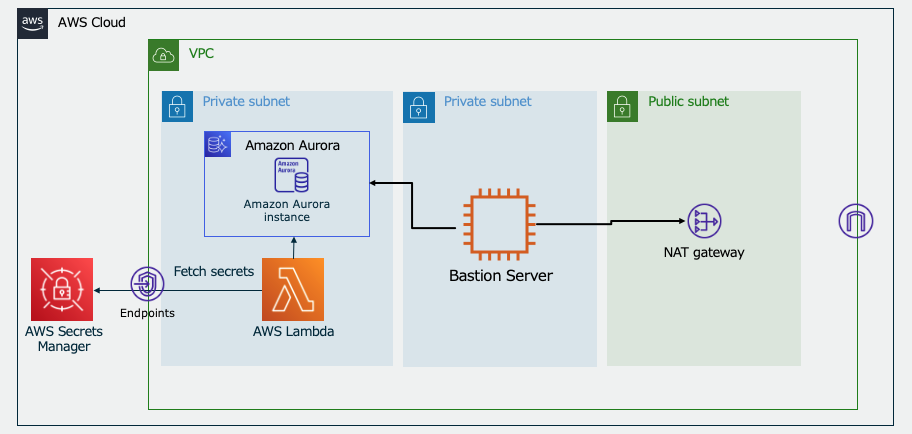

# Amazon Aurora for Postgresql Sandbox w/ 踏み台サーバ & スキーマ管理Lambda

## Overview

本サンプルでは、主に以下3つのリソースがデプロイされます。

- Amazon Aurora for Postgresql
- 踏み台サーバー（EC2 インスタンス）
- AWS Lambda（べき等·宣言的に SQL を管理するsqldefを利用したスキーマ管理）

Lambda 関数を実行することによって、簡単にデータベースのテーブル作成·初期データをシードを行うことができます。

任意のSQLを踏み台サーバーから実行することもできます。一時的なデータベースを作って動作検証したい、そんなユースケースにぴったりです。

[Serverless Database Schema Management for RDBMS](https://github.com/aws-samples/aws-lambda-with-rdb)を基に作成しています。

## アーキテクチャ

CDKスタックは1つだけです。そのアーキテクチャを以下に示します。



## ディレクトリ構成

```sh
.
├── bin
│   └── db-definer.ts              # Define CDK Stack
├── lambda
│   └── db-definer
│       ├── schema                 # Table Definition. SQL file in this folder will be executed
│       └── seed
│           └── postgresql         # Seed SQL file for PostgreSQL
└── lib
    ├── database.ts                # Amazon Aurora and AWS Lambda are defined here
    └── db-definer-stack.ts        # VPC and database

```

## 主な技術スタック

- aws-cdk
- typescript
- sqldef
  - 詳細は以下のリンクをご参照ください。
  - [k0kubun/sqldef: Idempotent schema management for MySQL, PostgreSQL, and more](https://github.com/k0kubun/sqldef)

## 前提条件

- npm
- aws cli v2
- cdk
- docker
- configuration of aws profile

## Getting Started

### 1. リポジトリをクローンする

- `git clone` コマンドを用いてソースコードをクローンします

### 2. リソースをデプロイする

- Run `npm ci` command in the top of this directory.
- Run `npx cdk deploy` to deploy these resouces.
- When resouces are successfully deployed, outputs such as `DbDefinerStack.DBDBInitCommand` will be shown in the terminal. These values will be used to define tables.
- You can edit DDL in `./lambda/db-definer/schema` and DML in `./lambda/db-definer/seed` before deploy.

- このディレクトリの一番上の階層で `npm ci` コマンドを実行します。
- `npx cdk deploy`を実行して、これらのリソースをデプロイします。
- リソースが正常にデプロイされると、ターミナルに `DbDefinerStack.DBDBInitCommand` が出力されます。このコマンドを利用すると AWS Lambda を利用してデータベースを初期化することができます。
- デプロイ前に `./lambda/db-definer/schema` にあるDDLと `./lambda/db-definer/seed` にあるDMLを編集することができます。

```sh
Outputs:
DbDefinerStack.DBDBLambdaNameXXXXXXX = DbDefinerStack-DBDbDefinerXXXXXX
Stack ARN:
arn:aws:cloudformation:xyz-region-x:XXXXXXXXXXX:stack/DbDefinerStack/XXXXXXXXXXXXXXXXXX
```

### 3. テーブルを定義する

この CDK によってデプロイされる Lambda 関数 は以下のコマンドを実行できます。

1. `init`  
    データベースをドロップして作成します。このコマンドは開発環境下で使用することができます。
    `./lambda/db-definer/schema` に配置してあるファイルが反映されます。
2. `preview`  
    sqldefを使用して、`./lambda/db-definer/schema`にあるSQLファイルによるテーブルの定義の変更をプレビューします。
3. `sync`  
    sqldefを使ってデータベースのテーブルを`./lambda/db-definer/schema`にあるSQLファイルに同期させます。
    sqldefで実行されるSQLは、`preview`コマンドで事前に確認することができます。
4. `seed`  
    `./lambda/db-definer/seed/postgresql`に配置されているSQLファイルを実行します。
    このコマンドは、データベースへのシードデータの挿入に使用することができます。

例えば、DBを初期化する場合、ターミナルで以下のコマンドを実行します。
この Lambda 関数は AWS Management Console からも実行することができます。

```sh
aws lambda invoke --function-name [DbDefinerStack.DBDBLambdaName] --payload '{"command":"init"}' --cli-binary-format raw-in-base64-out res.txt
```

### 踏み台サーバーへのアクセス

Systems Manager Session Manager を使って EC2 インスタンスにログインし、以下のコマンドで RDS のデータベースへログインすることができます。

パスワードやホスト名は Secrets Manager から確認することができます。

```text
PGPASSWORD=<password> \
psql -h <host name> \
-U postgres prototype
```

## Security

See [CONTRIBUTING](CONTRIBUTING.md#security-issue-notifications) for more information.

## License

This library is licensed under the MIT-0 License. See the LICENSE file.
